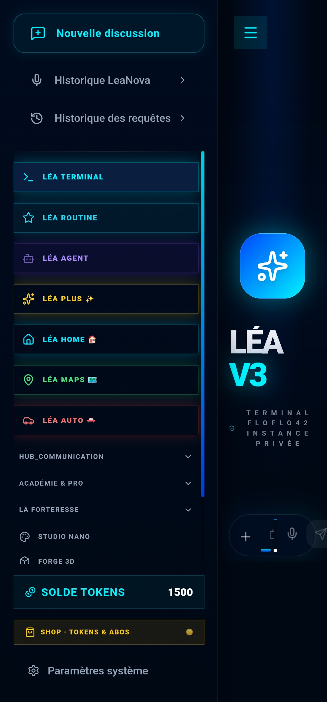
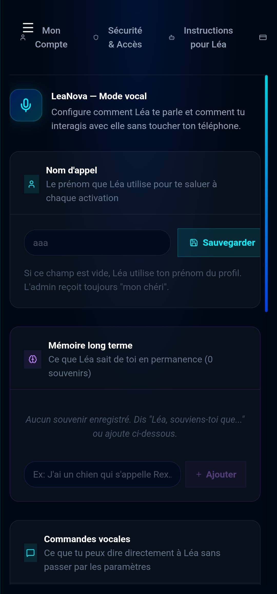
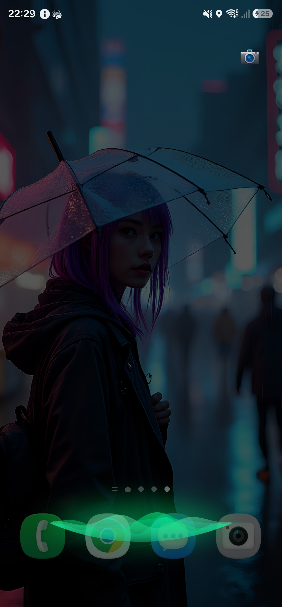
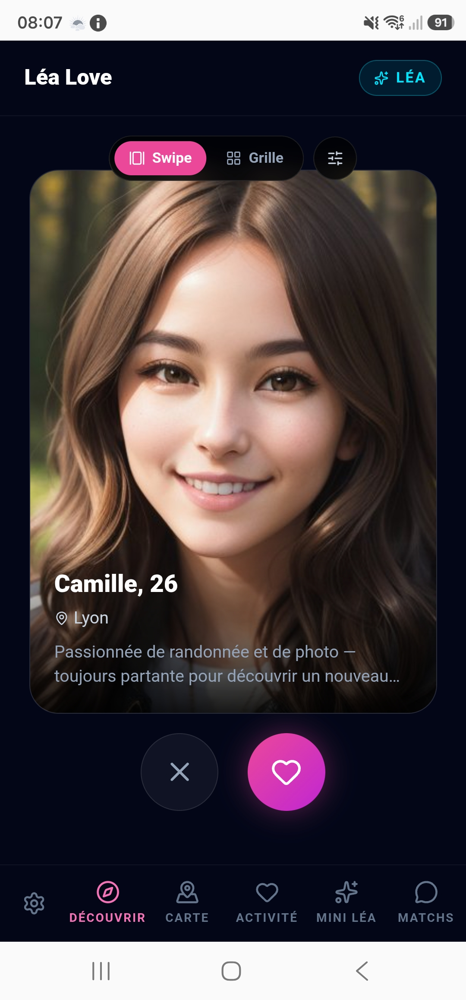
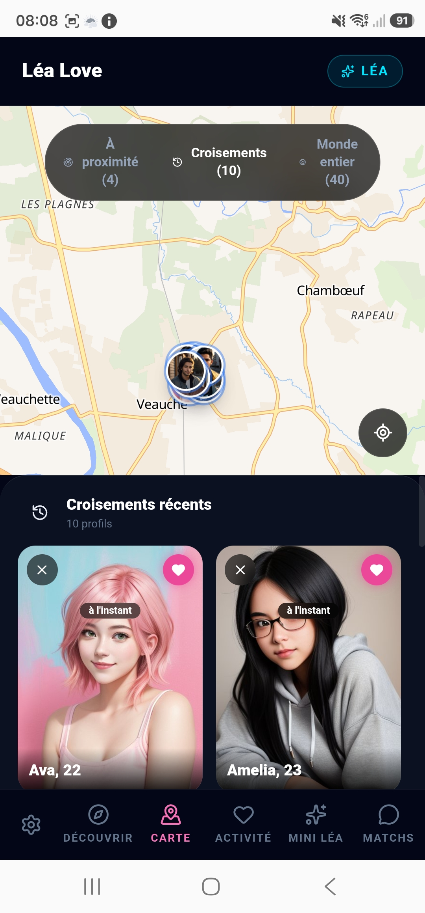
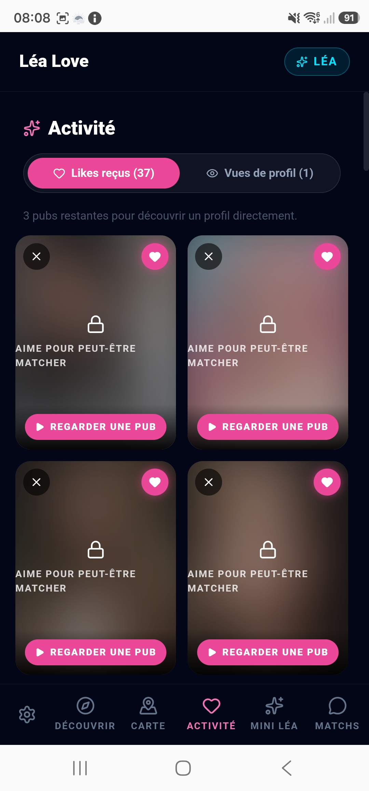

# LÉA — Intelligence Artificielle Locale

> Une IA qui tourne sur notre propre matériel. Tes données ne quittent jamais nos serveurs locaux.

🌐 **Disponible sur** : [lea-bunker.lea-ia-local.com](https://lea-bunker.lea-ia-local.com/)

---

## C'est quoi Léa ?

Les assistants IA comme ChatGPT envoient toutes tes données sur des serveurs américains.

Léa tourne sur **notre propre infrastructure physique** — GPU dédié, serveur local, zéro cloud. Tes conversations, tes images, ta voix : tout reste chez nous, en France.

Crée un compte, télécharge l'APK, et c'est parti.

---

## Aperçu

  
  
  

---

## Modules disponibles

| Module | Description | Statut |
|---|---|---|
| **Léa Terminal** | Assistant IA conversationnel (voix + texte) | ✅ Disponible |
| **Léa Agent** | Agent IA qui code et automatise à ta place | ✅ Disponible |
| **Studio Nano** | Génération d'images IA (FLUX, SDXL, SD1.5) | ✅ Disponible |
| **Studio Lyria** | Génération musicale (MusicGen) | ✅ Disponible |
| **Studio Veo** | Génération vidéo IA | ✅ Disponible |
| **Studio Forge 3D** | Génération de modèles 3D | ✅ Disponible |
| **Léa Chat** | Messagerie chiffrée entre utilisateurs | ✅ Disponible |
| **Léa Protect** | Sécurité & surveillance | ✅ Disponible |
| **Léa Academy** | Cours et apprentissage | ✅ Disponible |
| **Léa Crypto** | Trading et portefeuille crypto | ✅ Disponible |
| **Languages** | Traduction locale multi-langues | ✅ Disponible |

---

## Application Mobile

Léa est disponible en application Android native.

> Télécharge le dernier APK dans la section [Releases](../../releases)

**Compatible** : Android 8.0+ (API 26)

---

## Comment accéder à Léa ?

1. Va sur [lea-bunker.lea-ia-local.com](https://lea-bunker.lea-ia-local.com/)
2. Crée un compte gratuit
3. Commence à utiliser Léa directement

**Compte gratuit** : accès à l'ensemble des modules. Des tokens sont disponibles à l'achat pour les générations avancées (images, vidéos, musique).

---

## Écosystème Léa

Léa n'est pas qu'un assistant seul — c'est le cœur d'un écosystème d'applications connectées, toutes bâties sur la même infrastructure locale.

### Léa Love

Une application de rencontre à part entière, connectée à Léa (même compte, même identité). Léa y modère les messages, vérifie les profils, et peut même discuter avec toi de tes conversations.

  
  
  

### Léa Vitrine

La page de présentation publique du projet : 🌐 [lea-vitrine.lea-ia-local.com](https://lea-vitrine.lea-ia-local.com)

---

## Notre infrastructure

Léa tourne sur du matériel physique dédié, pas sur le cloud :

| Composant | Détail |
|---|---|
| GPU | RTX 3060 12 Go VRAM |
| Stockage | 7 To |
| OS | Ubuntu 22.04 |
| Modèles LLM | DeepSeek Coder V2 16B, Qwen 2.5 14B, Mistral Nemo 12B, LLaVA (vision), Dolphin Phi |
| Modèles génératifs | FLUX Dev, JuggernautXL, RealVisXL V5, DreamShaper 8, MusicGen, Piper TTS |

---

## Ce repo

Ce dépôt contient **l'interface frontend** de Léa (React + TypeScript + Android).

Le serveur backend (moteur IA, gestion utilisateurs, génération) est propriétaire et non publié.

---

## Stack technique

- **Frontend** : React 18 + TypeScript + Vite + Tailwind CSS
- **Mobile** : Capacitor (Android natif)
- **IA locale** : Ollama (DeepSeek, Qwen, FLUX...)
- **Voix** : Piper TTS (synthèse vocale offline)

---

## Contribuer

Les contributions sur l'interface sont les bienvenues :
- Corriger des bugs UI
- Améliorer l'accessibilité
- Traduire l'interface

Ouvre une **Issue** ou une **Pull Request**.

---

## Licence

Interface publiée sous licence **MIT**.
Le backend et les modèles IA entraînés restent propriétaires.

---

*Projet développé et maintenu par [@florent4256-eng](https://github.com/florent4256-eng)*
